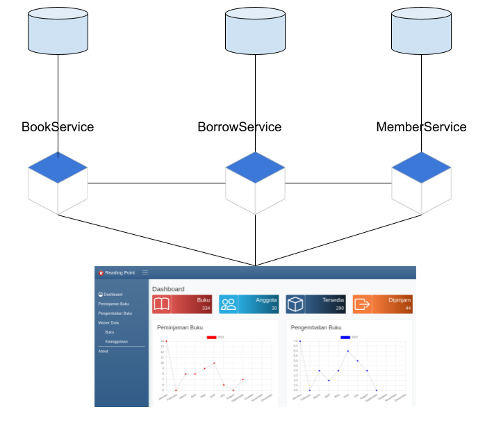

## Repositories

1. [BookService](https://github.com/ezra-dalimunthe/BookService)
2. [MemberService](https://github.com/ezra-dalimunthe/MemberService)
3. [BorrowService](https://github.com/ezra-dalimunthe/BorrowService)
4. [ReadingPoint](https://github.com/ezra-dalimunthe/ReadingPointWebFrontEnd)

## Architecture System

The current architecture looks like this:
1. No api gateway
2. No user Authenticaton nor user authorization
3. Each service has it's own database 

